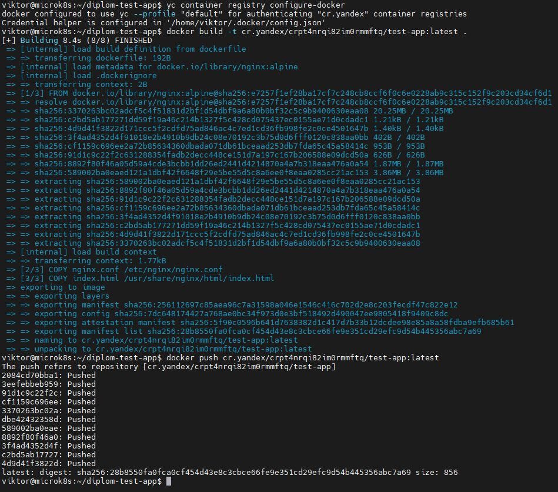
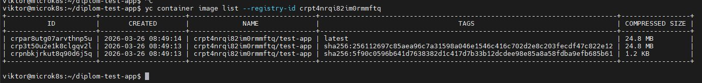
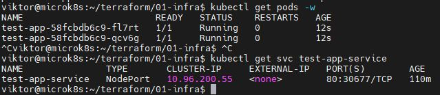
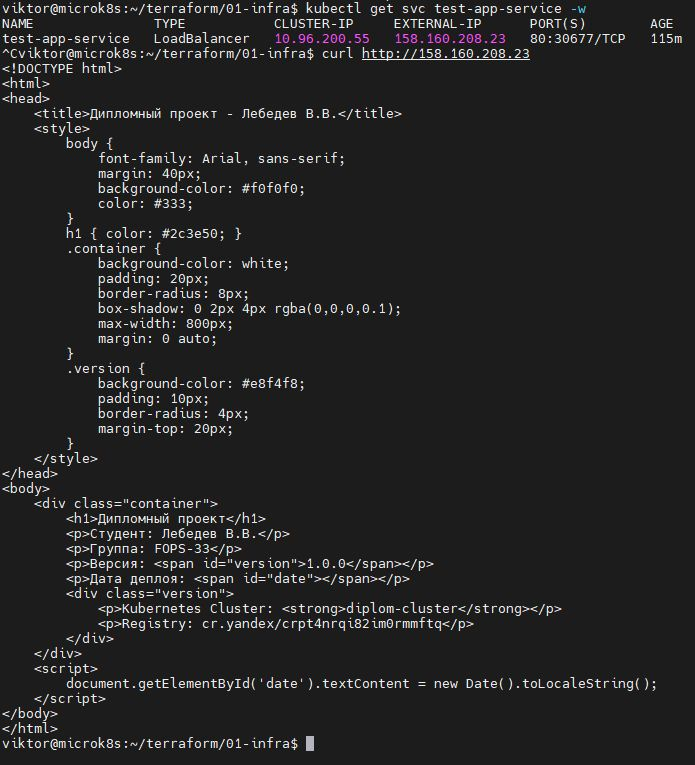
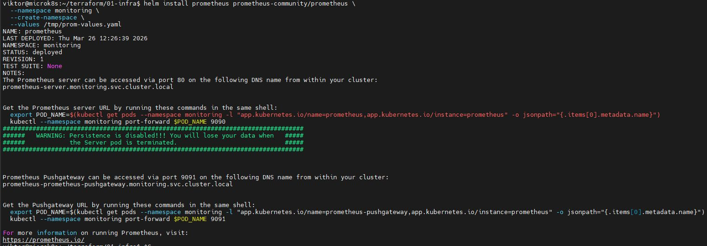
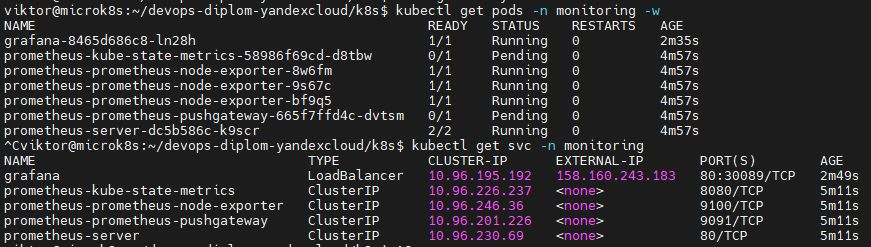
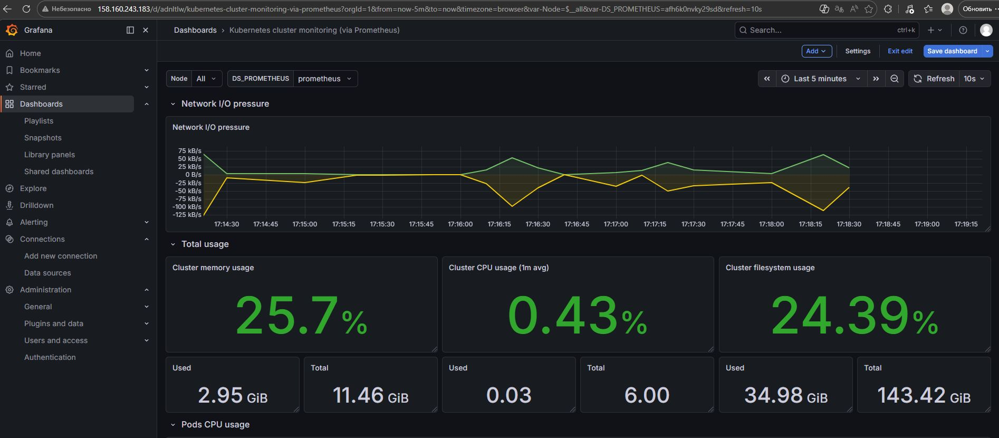
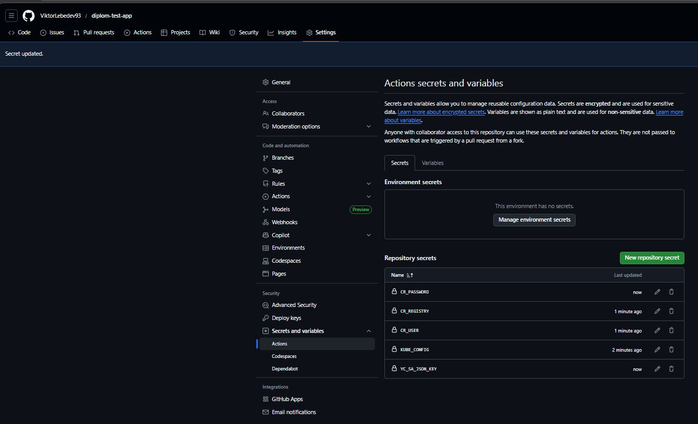
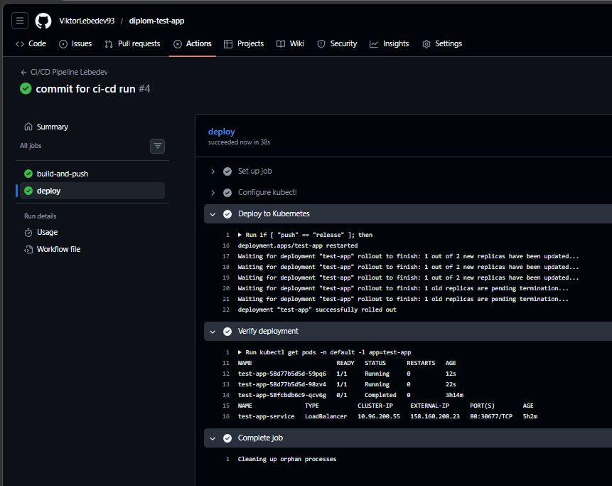

# Дипломный практикум в Yandex.Cloud Лебедев В.В. FOPS-33
  * [Цели:](#цели)
  * [Этапы выполнения:](#этапы-выполнения)
     * [Создание облачной инфраструктуры](#создание-облачной-инфраструктуры)
     * [Создание Kubernetes кластера](#создание-kubernetes-кластера)
     * [Создание тестового приложения](#создание-тестового-приложения)
     * [Подготовка cистемы мониторинга и деплой приложения](#подготовка-cистемы-мониторинга-и-деплой-приложения)
     * [Установка и настройка CI/CD](#установка-и-настройка-cicd)
  * [Что необходимо для сдачи задания?](#что-необходимо-для-сдачи-задания)
  * [Как правильно задавать вопросы дипломному руководителю?](#как-правильно-задавать-вопросы-дипломному-руководителю)

**Перед началом работы над дипломным заданием изучите [Инструкция по экономии облачных ресурсов](https://github.com/netology-code/devops-materials/blob/master/cloudwork.MD).**

---
## Цели:

1. Подготовить облачную инфраструктуру на базе облачного провайдера Яндекс.Облако.
2. Запустить и сконфигурировать Kubernetes кластер.
3. Установить и настроить систему мониторинга.
4. Настроить и автоматизировать сборку тестового приложения с использованием Docker-контейнеров.
5. Настроить CI для автоматической сборки и тестирования.
6. Настроить CD для автоматического развёртывания приложения.

---
## Этапы выполнения:


### Создание облачной инфраструктуры

Для начала необходимо подготовить облачную инфраструктуру в ЯО при помощи [Terraform](https://www.terraform.io/).

Особенности выполнения:

- Бюджет купона ограничен, что следует иметь в виду при проектировании инфраструктуры и использовании ресурсов;
Для облачного k8s используйте региональный мастер(неотказоустойчивый). Для self-hosted k8s минимизируйте ресурсы ВМ и долю ЦПУ. В обоих вариантах используйте прерываемые ВМ для worker nodes.

Предварительная подготовка к установке и запуску Kubernetes кластера.

1. Создайте сервисный аккаунт, который будет в дальнейшем использоваться Terraform для работы с инфраструктурой с необходимыми и достаточными правами. Не стоит использовать права суперпользователя
2. Подготовьте [backend](https://developer.hashicorp.com/terraform/language/backend) для Terraform:  
   а. Рекомендуемый вариант: S3 bucket в созданном ЯО аккаунте(создание бакета через TF)
   б. Альтернативный вариант:  [Terraform Cloud](https://app.terraform.io/)
3. Создайте конфигурацию Terrafrom, используя созданный бакет ранее как бекенд для хранения стейт файла. Конфигурации Terraform для создания сервисного аккаунта и бакета и основной инфраструктуры следует сохранить в разных папках.
4. Создайте VPC с подсетями в разных зонах доступности.
5. Убедитесь, что теперь вы можете выполнить команды `terraform destroy` и `terraform apply` без дополнительных ручных действий.
6. В случае использования [Terraform Cloud](https://app.terraform.io/) в качестве [backend](https://developer.hashicorp.com/terraform/language/backend) убедитесь, что применение изменений успешно проходит, используя web-интерфейс Terraform cloud.

Ожидаемые результаты:

1. Terraform сконфигурирован и создание инфраструктуры посредством Terraform возможно без дополнительных ручных действий, стейт основной конфигурации сохраняется в бакете или Terraform Cloud
2. Полученная конфигурация инфраструктуры является предварительной, поэтому в ходе дальнейшего выполнения задания возможны изменения.

---
### РЕШЕНИЕ. Создание облачной инфраструктуры

Подготовим сервисный аккаунт и бекенд

terraform/00-sa/variables.tf
```
variable "yc_token" {
  description = "Yandex Cloud OAuth token"
  type        = string
  sensitive   = true
}

variable "yc_cloud_id" {
  description = "Yandex Cloud ID"
  type        = string
}

variable "yc_folder_id" {
  description = "Yandex Cloud Folder ID"
  type        = string
}

variable "default_zone" {
  description = "Default availability zone"
  type        = string
  default     = "ru-central1-b"
}
```
terraform/00-sa/main.tf
```
terraform {
  required_version = ">= 1.0"
  required_providers {
    yandex = {
      source  = "yandex-cloud/yandex"
      version = "~> 0.90"
    }
  }
}

provider "yandex" {
  token     = var.yc_token
  cloud_id  = var.yc_cloud_id
  folder_id = var.yc_folder_id
  zone      = var.default_zone
}

# Создание сервисного аккаунта для Terraform
resource "yandex_iam_service_account" "tf_sa" {
  name        = "terraform-sa"
  description = "Service account for Terraform operations"
}

# Назначение роли editor (минимально необходимые права)
resource "yandex_resourcemanager_folder_iam_member" "tf_sa_editor" {
  folder_id = var.yc_folder_id
  role      = "editor"
  member    = "serviceAccount:${yandex_iam_service_account.tf_sa.id}"
}

# Создание статического ключа для сервисного аккаунта (для бекенда)
resource "yandex_iam_service_account_static_access_key" "tf_sa_key" {
  service_account_id = yandex_iam_service_account.tf_sa.id
  description        = "Static access key for Terraform S3 backend"
}

# Создание бакета для хранения state файла
resource "yandex_storage_bucket" "tf_state" {
  bucket     = "tf-state-lebedev-vv-diplom"
  acl        = "private"
  folder_id  = var.yc_folder_id

  versioning {
    enabled = true
  }

  lifecycle_rule {
    id      = "cleanup-old-versions"
    enabled = true
    
    noncurrent_version_expiration {
      days = 30
    }
  }

  tags = {
    Environment = "terraform"
    Project     = "diplom"
    Student     = "lebedev-vv"
  }
}

# Выводы для использования в основной конфигурации
output "sa_key_id" {
  value     = yandex_iam_service_account_static_access_key.tf_sa_key.id
  sensitive = true
}

output "sa_secret_key" {
  value     = yandex_iam_service_account_static_access_key.tf_sa_key.secret_key
  sensitive = true
}

output "tf_state_bucket" {
  value = yandex_storage_bucket.tf_state.bucket
}

output "service_account_id" {
  value = yandex_iam_service_account.tf_sa.id
}
```

Подготовим основную инфраструктуру

terraform/01-infra/variables.tf
```
variable "yc_token" {
  description = "Yandex Cloud OAuth token"
  type        = string
  sensitive   = true
}

variable "yc_cloud_id" {
  description = "Yandex Cloud ID"
  type        = string
}

variable "yc_folder_id" {
  description = "Yandex Cloud Folder ID"
  type        = string
}

variable "default_zone" {
  description = "Default availability zone"
  type        = string
  default     = "ru-central1-b"
}

variable "cluster_name" {
  description = "Name of the Kubernetes cluster"
  type        = string
  default     = "diplom-cluster"
}

variable "node_group_size" {
  description = "Number of worker nodes"
  type        = number
  default     = 3
}

variable "node_cores" {
  description = "Number of CPU cores per node"
  type        = number
  default     = 2
}

variable "node_memory" {
  description = "Memory in GB per node"
  type        = number
  default     = 4
}

variable "public_key_path" {
  description = "Path to public SSH key"
  type        = string
  default     = "~/.ssh/id_rsa.pub"
}
```
terraform/01-infra/main.tf
```
terraform {
  required_version = ">= 1.0"
  required_providers {
    yandex = {
      source  = "yandex-cloud/yandex"
      version = "~> 0.90"
    }
  }
  # backend "s3" полностью удалён
}

provider "yandex" {
  token     = var.yc_token
  cloud_id  = var.yc_cloud_id
  folder_id = var.yc_folder_id
  zone      = var.default_zone
}
}
```
terraform/01-infra/network.tf
```
# VPC сеть
resource "yandex_vpc_network" "diplom_network" {
  name = "diplom-network"
}

# Публичные подсети в трёх зонах доступности
resource "yandex_vpc_subnet" "public_subnets" {
  count = 3

  name           = "public-subnet-${count.index + 1}"
  zone           = element(["ru-central1-a", "ru-central1-b", "ru-central1-d"], count.index)
  network_id     = yandex_vpc_network.diplom_network.id
  v4_cidr_blocks = ["10.${count.index + 10}.0.0/24"]
}

# Приватные подсети для worker nodes (прерываемые ВМ)
resource "yandex_vpc_subnet" "private_subnets" {
  count = 3

  name           = "private-subnet-${count.index + 1}"
  zone           = element(["ru-central1-a", "ru-central1-b", "ru-central1-d"], count.index)
  network_id     = yandex_vpc_network.diplom_network.id
  v4_cidr_blocks = ["192.168.${count.index + 10}.0/24"]
}

# NAT-инстанс в публичной подсети
resource "yandex_compute_instance" "nat_instance" {
  name        = "nat-instance"
  platform_id = "standard-v3"
  zone        = "ru-central1-a"

  resources {
    cores  = 2
    memory = 2
  }

  boot_disk {
    initialize_params {
      image_id = "fd80mrhj8fl2oe87o4e1"  # NAT instance image
      size     = 20
    }
  }

  network_interface {
    subnet_id  = yandex_vpc_subnet.public_subnets[0].id
    ip_address = "10.10.0.254"
    nat        = true
  }

  metadata = {
    ssh-keys = "ubuntu:${file(var.public_key_path)}"
  }
}

# Route tables для приватных подсетей
resource "yandex_vpc_route_table" "private_routes" {
  count = 3

  name       = "private-route-${count.index + 1}"
  network_id = yandex_vpc_network.diplom_network.id

  static_route {
    destination_prefix = "0.0.0.0/0"
    next_hop_address   = yandex_compute_instance.nat_instance.network_interface[0].ip_address
  }
}

# Приватные подсети с route tables
resource "yandex_vpc_subnet" "private_subnets_routed" {
  count = 3

  name           = "private-subnet-routed-${count.index + 1}"
  zone           = element(["ru-central1-a", "ru-central1-b", "ru-central1-d"], count.index)
  network_id     = yandex_vpc_network.diplom_network.id
  v4_cidr_blocks = ["192.168.${count.index + 20}.0/24"]
  route_table_id = yandex_vpc_route_table.private_routes[count.index].id
}
```
terraform/01-infra/k8s.tf
```
# KMS ключ для шифрования данных в кластере
resource "yandex_kms_symmetric_key" "k8s_key" {
  name              = "k8s-encryption-key"
  description       = "Key for Kubernetes cluster encryption"
  default_algorithm = "AES_128"
  rotation_period   = "8760h"
}

# Сервисный аккаунт для кластера
resource "yandex_iam_service_account" "k8s_cluster_sa" {
  name        = "k8s-cluster-sa"
  description = "Service account for Kubernetes cluster"
}

resource "yandex_iam_service_account" "k8s_node_sa" {
  name        = "k8s-node-sa"
  description = "Service account for Kubernetes nodes"
}

resource "yandex_resourcemanager_folder_iam_member" "k8s_cluster_sa_editor" {
  folder_id = var.yc_folder_id
  role      = "editor"
  member    = "serviceAccount:${yandex_iam_service_account.k8s_cluster_sa.id}"
}

resource "yandex_resourcemanager_folder_iam_member" "k8s_node_sa_editor" {
  folder_id = var.yc_folder_id
  role      = "editor"
  member    = "serviceAccount:${yandex_iam_service_account.k8s_node_sa.id}"
}

# Региональный мастер Kubernetes
resource "yandex_kubernetes_cluster" "diplom_cluster" {
  name        = var.cluster_name
  description = "Kubernetes cluster for diploma project"
  network_id  = yandex_vpc_network.diplom_network.id

  master {
    version = "1.31"
    regional {
      region = "ru-central1"
      location {
        zone      = "ru-central1-a"
        subnet_id = yandex_vpc_subnet.public_subnets[0].id
      }
      location {
        zone      = "ru-central1-b"
        subnet_id = yandex_vpc_subnet.public_subnets[1].id
      }
      location {
        zone      = "ru-central1-d"
        subnet_id = yandex_vpc_subnet.public_subnets[2].id
      }
    }
    public_ip = true
  }

  service_account_id      = yandex_iam_service_account.k8s_cluster_sa.id
  node_service_account_id = yandex_iam_service_account.k8s_node_sa.id

  kms_provider {
    key_id = yandex_kms_symmetric_key.k8s_key.id
  }

  depends_on = [
    yandex_resourcemanager_folder_iam_member.k8s_cluster_sa_editor,
    yandex_resourcemanager_folder_iam_member.k8s_node_sa_editor
  ]
}

# Группа worker nodes (прерываемые ВМ)
resource "yandex_kubernetes_node_group" "worker_group" {
  cluster_id = yandex_kubernetes_cluster.diplom_cluster.id
  name       = "worker-group"
  version    = "1.31"

  instance_template {
    platform_id = "standard-v3"
    
    resources {
      cores  = var.node_cores
      memory = var.node_memory
    }

    boot_disk {
      type = "network-ssd"
      size = 50
    }

    network_interface {
      subnet_ids = [
        yandex_vpc_subnet.private_subnets[0].id,
        yandex_vpc_subnet.private_subnets[1].id,
        yandex_vpc_subnet.private_subnets[2].id
      ]
      nat = false
    }

    metadata = {
      ssh-keys = "ubuntu:${file(var.public_key_path)}"
    }
  }

  scale_policy {
    fixed_scale {
      size = var.node_group_size
    }
  }

  allocation_policy {
    location {
      zone = "ru-central1-a"
    }
    location {
      zone = "ru-central1-b"
    }
    location {
      zone = "ru-central1-d"
    }
  }

  node_labels = {
    "node-type"   = "worker"
    "preemptible" = "true"
  }

  node_taints = ["preemptible=true:NoSchedule"]
}

# Container Registry для хранения Docker образов
resource "yandex_container_registry" "diplom_registry" {
  name      = "diplom-registry"
  folder_id = var.yc_folder_id
}

# Назначение прав на Registry
resource "yandex_resourcemanager_folder_iam_member" "registry_pusher" {
  folder_id = var.yc_folder_id
  role      = "container-registry.images.pusher"
  member    = "serviceAccount:${yandex_iam_service_account.k8s_cluster_sa.id}"
}

resource "yandex_resourcemanager_folder_iam_member" "registry_puller" {
  folder_id = var.yc_folder_id
  role      = "container-registry.images.puller"
  member    = "serviceAccount:${yandex_iam_service_account.k8s_node_sa.id}"
}

# Выводы
output "cluster_endpoint" {
  value = yandex_kubernetes_cluster.diplom_cluster.master[0].external_v4_endpoint
}

output "cluster_ca_certificate" {
  value     = yandex_kubernetes_cluster.diplom_cluster.master[0].cluster_ca_certificate
  sensitive = true
}

output "container_registry_id" {
  value = yandex_container_registry.diplom_registry.id
}
```

Инициализируем terraform


Применяем изменения и сохраняем вывод с ключами для дальнейшего использования


Инициализируем


Применяем изменения через Terraform


---
### Создание Kubernetes кластера

На этом этапе необходимо создать [Kubernetes](https://kubernetes.io/ru/docs/concepts/overview/what-is-kubernetes/) кластер на базе предварительно созданной инфраструктуры.   Требуется обеспечить доступ к ресурсам из Интернета.

Это можно сделать двумя способами:

1. Рекомендуемый вариант: самостоятельная установка Kubernetes кластера.  
   а. При помощи Terraform подготовить как минимум 3 виртуальных машины Compute Cloud для создания Kubernetes-кластера. Тип виртуальной машины следует выбрать самостоятельно с учётом требовании к производительности и стоимости. Если в дальнейшем поймете, что необходимо сменить тип инстанса, используйте Terraform для внесения изменений.  
   б. Подготовить [ansible](https://www.ansible.com/) конфигурации, можно воспользоваться, например [Kubespray](https://kubernetes.io/docs/setup/production-environment/tools/kubespray/)  
   в. Задеплоить Kubernetes на подготовленные ранее инстансы, в случае нехватки каких-либо ресурсов вы всегда можете создать их при помощи Terraform.
2. Альтернативный вариант: воспользуйтесь сервисом [Yandex Managed Service for Kubernetes](https://cloud.yandex.ru/services/managed-kubernetes)  
  а. С помощью terraform resource для [kubernetes](https://registry.terraform.io/providers/yandex-cloud/yandex/latest/docs/resources/kubernetes_cluster) создать **региональный** мастер kubernetes с размещением нод в разных 3 подсетях      
  б. С помощью terraform resource для [kubernetes node group](https://registry.terraform.io/providers/yandex-cloud/yandex/latest/docs/resources/kubernetes_node_group)
  
Ожидаемый результат:

1. Работоспособный Kubernetes кластер.
2. В файле `~/.kube/config` находятся данные для доступа к кластеру.
3. Команда `kubectl get pods --all-namespaces` отрабатывает без ошибок.

---
### РЕШЕНИЕ. Создание Kubernetes кластера
Настроим доступ к кластеру и проверим его создание


Кластер успешно запущен:

3 worker nodes с версией v1.31.2

CoreDNS, kube-proxy, metrics-server и другие системные компоненты

---
### Создание тестового приложения

Для перехода к следующему этапу необходимо подготовить тестовое приложение, эмулирующее основное приложение разрабатываемое вашей компанией.

Способ подготовки:

1. Рекомендуемый вариант:  
   а. Создайте отдельный git репозиторий с простым nginx конфигом, который будет отдавать статические данные.  
   б. Подготовьте Dockerfile для создания образа приложения.  
2. Альтернативный вариант:  
   а. Используйте любой другой код, главное, чтобы был самостоятельно создан Dockerfile.

Ожидаемый результат:

1. Git репозиторий с тестовым приложением и Dockerfile.
2. Регистри с собранным docker image. В качестве регистри может быть DockerHub или [Yandex Container Registry](https://cloud.yandex.ru/services/container-registry), созданный также с помощью terraform.

---
### РЕШЕНИЕ. Создание тестового приложения

Создали отдельный репозиторий https://github.com/ViktorLebedev93/diplom-test-app

diplom-test-app/dockerfile
```
FROM nginx:alpine

COPY nginx.conf /etc/nginx/nginx.conf
COPY index.html /usr/share/nginx/html/index.html

EXPOSE 80

CMD ["nginx", "-g", "daemon off;"]
```
diplom-test-app/nginx.conf
```
events {
    worker_connections 1024;
}

http {
    server {
        listen 80;
        server_name _;

        location / {
            root /usr/share/nginx/html;
            index index.html;
        }

        location /health {
            access_log off;
            return 200 "healthy\n";
            add_header Content-Type text/plain;
        }
    }
}
```
diplom-test-app/index.html
```
<!DOCTYPE html>
<html>
<head>
    <title>Дипломный проект - Лебедев В.В.</title>
    <style>
        body {
            font-family: Arial, sans-serif;
            margin: 40px;
            background-color: #f0f0f0;
            color: #333;
        }
        h1 { color: #2c3e50; }
        .container {
            background-color: white;
            padding: 20px;
            border-radius: 8px;
            box-shadow: 0 2px 4px rgba(0,0,0,0.1);
            max-width: 800px;
            margin: 0 auto;
        }
        .version {
            background-color: #e8f4f8;
            padding: 10px;
            border-radius: 4px;
            margin-top: 20px;
        }
    </style>
</head>
<body>
    <div class="container">
        <h1>Дипломный проект</h1>
        <p>Студент: Лебедев В.В.</p>
        <p>Группа: FOPS-33</p>
        <p>Версия: <span id="version">1.0.0</span></p>
        <p>Дата деплоя: <span id="date"></span></p>
        <div class="version">
            <p>Kubernetes Cluster: <strong>diplom-cluster</strong></p>
            <p>Registry: cr.yandex/crpt4nrqi82im0rmmftq</p>
        </div>
    </div>
    <script>
        document.getElementById('date').textContent = new Date().toLocaleString();
    </script>
</body>
</html>
```

Настраиваем credintal helper, собираем образ тестового приложения и отправляем его



Убеждаемся что образ появился в registry



Создаем манифест деплоя для K8S k8s/deployment.yaml

```
apiVersion: apps/v1
kind: Deployment
metadata:
  name: test-app
  namespace: default
spec:
  replicas: 2
  selector:
    matchLabels:
      app: test-app
  template:
    metadata:
      labels:
        app: test-app
    spec:
      tolerations:
      - key: "preemptible"
        operator: "Equal"
        value: "true"
        effect: "NoSchedule"
      containers:
      - name: test-app
        image: cr.yandex/crpt4nrqi82im0rmmftq/test-app:latest
        ports:
        - containerPort: 80
        livenessProbe:
          httpGet:
            path: /health
            port: 80
          initialDelaySeconds: 10
          periodSeconds: 10
        readinessProbe:
          httpGet:
            path: /health
            port: 80
          initialDelaySeconds: 5
          periodSeconds: 5
---
apiVersion: v1
kind: Service
metadata:
  name: test-app-service
  namespace: default
spec:
  selector:
    app: test-app
  ports:
  - port: 80
    targetPort: 80
  type: LoadBalancer
```

Применяем манифест. Создание подов и сервисов.




Проверяем доступность по внешнему IP через curl



---

### Подготовка cистемы мониторинга и деплой приложения

Уже должны быть готовы конфигурации для автоматического создания облачной инфраструктуры и поднятия Kubernetes кластера.  
Теперь необходимо подготовить конфигурационные файлы для настройки нашего Kubernetes кластера.

Цель:
1. Задеплоить в кластер [prometheus](https://prometheus.io/), [grafana](https://grafana.com/), [alertmanager](https://github.com/prometheus/alertmanager), [экспортер](https://github.com/prometheus/node_exporter) основных метрик Kubernetes.
2. Задеплоить тестовое приложение, например, [nginx](https://www.nginx.com/) сервер отдающий статическую страницу.

Способ выполнения:
1. Воспользоваться пакетом [kube-prometheus](https://github.com/prometheus-operator/kube-prometheus), который уже включает в себя [Kubernetes оператор](https://operatorhub.io/) для [grafana](https://grafana.com/), [prometheus](https://prometheus.io/), [alertmanager](https://github.com/prometheus/alertmanager) и [node_exporter](https://github.com/prometheus/node_exporter). Альтернативный вариант - использовать набор helm чартов от [bitnami](https://github.com/bitnami/charts/tree/main/bitnami).

### Деплой инфраструктуры в terraform pipeline

1. Если на первом этапе вы не воспользовались [Terraform Cloud](https://app.terraform.io/), то задеплойте и настройте в кластере [atlantis](https://www.runatlantis.io/) для отслеживания изменений инфраструктуры. Альтернативный вариант 3 задания: вместо Terraform Cloud или atlantis настройте на автоматический запуск и применение конфигурации terraform из вашего git-репозитория в выбранной вами CI-CD системе при любом комите в main ветку. Предоставьте скриншоты работы пайплайна из CI/CD системы.

Ожидаемый результат:
1. Git репозиторий с конфигурационными файлами для настройки Kubernetes.
2. Http доступ на 80 порту к web интерфейсу grafana.
3. Дашборды в grafana отображающие состояние Kubernetes кластера.
4. Http доступ на 80 порту к тестовому приложению.
5. Atlantis или terraform cloud или ci/cd-terraform
---
### РЕШЕНИЕ. Подготовка cистемы мониторинга и деплой приложения
Деплой Prometeus

k8s/prom-values.yaml
```
server:
  tolerations:
    - key: preemptible
      operator: Equal
      value: "true"
      effect: NoSchedule
  persistentVolume:
    enabled: false
  resources:
    requests:
      memory: 256Mi
      cpu: 100m
alertmanager:
  enabled: false
pushgateway:
  enabled: false
nodeExporter:
  enabled: false
kubeStateMetrics:
  enabled: false
```

Деплой Prometheus


Манифест для деплоя Графаны k8s/grafana.yaml
```
apiVersion: apps/v1
kind: Deployment
metadata:
  name: grafana
  namespace: monitoring
spec:
  replicas: 1
  selector:
    matchLabels:
      app: grafana
  template:
    metadata:
      labels:
        app: grafana
    spec:
      tolerations:
        - key: preemptible
          operator: Equal
          value: "true"
          effect: NoSchedule
      containers:
        - name: grafana
          image: grafana/grafana:latest
          ports:
            - containerPort: 3000
          env:
            - name: GF_SECURITY_ADMIN_PASSWORD
              value: "admin123"
            - name: GF_SECURITY_ADMIN_USER
              value: "admin"
            - name: GF_INSTALL_PLUGINS
              value: ""
            - name: GF_SERVER_ROOT_URL
              value: "http://localhost:3000"
          resources:
            requests:
              memory: "128Mi"
              cpu: "100m"
            limits:
              memory: "256Mi"
              cpu: "200m"
---
apiVersion: v1
kind: Service
metadata:
  name: grafana
  namespace: monitoring
spec:
  type: LoadBalancer
  ports:
    - port: 80
      targetPort: 3000
  selector:
    app: grafana
```

Поды запущены


Импортированный дашборд в Grafana по состоянию Kubernetes, сбор осуществляет Prometheus посредством node-exporters


---
### Установка и настройка CI/CD

Осталось настроить ci/cd систему для автоматической сборки docker image и деплоя приложения при изменении кода.

Цель:

1. Автоматическая сборка docker образа при коммите в репозиторий с тестовым приложением.
2. Автоматический деплой нового docker образа.

Можно использовать [teamcity](https://www.jetbrains.com/ru-ru/teamcity/), [jenkins](https://www.jenkins.io/), [GitLab CI](https://about.gitlab.com/stages-devops-lifecycle/continuous-integration/) или GitHub Actions.

Ожидаемый результат:

1. Интерфейс ci/cd сервиса доступен по http.
2. При любом коммите в репозиторие с тестовым приложением происходит сборка и отправка в регистр Docker образа.
3. При создании тега (например, v1.0.0) происходит сборка и отправка с соответствующим label в регистри, а также деплой соответствующего Docker образа в кластер Kubernetes.

---
### РЕШЕНИЕ.  Установка и настройка CI/CD

Настраиваем секреты в репозитории приложения



Создаем пайплайн в репозитории .github/workflows/ci-cd.yml

```
name: CI/CD Pipeline

on:
  push:
    branches: [ main ]
    paths:
      - 'Dockerfile'
      - 'nginx.conf'
      - 'index.html'
      - '.github/workflows/ci-cd.yml'
  release:
    types: [created]

env:
  REGISTRY: cr.yandex
  REGISTRY_ID: crpt4nrqi82im0rmmftq
  IMAGE_NAME: test-app
  K8S_NAMESPACE: default
  K8S_DEPLOYMENT: test-app

jobs:
  build-and-push:
    runs-on: ubuntu-latest
    steps:
      - name: Checkout code
        uses: actions/checkout@v4

      - name: Set up Docker Buildx
        uses: docker/setup-buildx-action@v3

      - name: Log in to Yandex Cloud Container Registry
        uses: docker/login-action@v3
        with:
          registry: ${{ env.REGISTRY }}
          username: ${{ secrets.CR_USER }}
          password: ${{ secrets.CR_PASSWORD }}

      - name: Build and push Docker image
        uses: docker/build-push-action@v5
        with:
          context: .
          push: true
          tags: |
            ${{ env.REGISTRY }}/${{ env.REGISTRY_ID }}/${{ env.IMAGE_NAME }}:latest
            ${{ env.REGISTRY }}/${{ env.REGISTRY_ID }}/${{ env.IMAGE_NAME }}:${{ github.sha }}

  deploy:
    needs: build-and-push
    if: github.ref == 'refs/heads/main' || github.event_name == 'release'
    runs-on: ubuntu-latest
    steps:
      - name: Install kubectl
        uses: azure/setup-kubectl@v4
        with:
          version: 'latest'

      - name: Configure kubectl
        run: |
          mkdir -p $HOME/.kube
          echo "${{ secrets.KUBE_CONFIG }}" | base64 -d > $HOME/.kube/config

      - name: Deploy to Kubernetes
        run: |
          if [ "${{ github.event_name }}" == "release" ]; then
            VERSION=${GITHUB_REF#refs/tags/}
            kubectl set image deployment/${{ env.K8S_DEPLOYMENT }} ${{ env.K8S_DEPLOYMENT }}=${{ env.REGISTRY }}/${{ env.REGISTRY_ID }}/${{ env.IMAGE_NAME }}:$VERSION -n ${{ env.K8S_NAMESPACE }}
          else
            kubectl rollout restart deployment/${{ env.K8S_DEPLOYMENT }} -n ${{ env.K8S_NAMESPACE }}
          fi
          kubectl rollout status deployment/${{ env.K8S_DEPLOYMENT }} -n ${{ env.K8S_NAMESPACE }} || (kubectl describe pod -n ${{ env.K8S_NAMESPACE }} -l app=${{ env.K8S_DEPLOYMENT }} && exit 1)

      - name: Verify deployment
        run: |
          kubectl get pods -n ${{ env.K8S_NAMESPACE }} -l app=${{ env.K8S_DEPLOYMENT }}
          kubectl get svc -n ${{ env.K8S_NAMESPACE }} test-app-service
```

Деплой ci-cd путем отправки коммита прошел успешно



---
## Что необходимо для сдачи задания?

1. Репозиторий с конфигурационными файлами Terraform и готовность продемонстрировать создание всех ресурсов с нуля.
2. Пример pull request с комментариями созданными atlantis'ом или снимки экрана из Terraform Cloud или вашего CI-CD-terraform pipeline.
3. Репозиторий с конфигурацией ansible, если был выбран способ создания Kubernetes кластера при помощи ansible.
4. Репозиторий с Dockerfile тестового приложения и ссылка на собранный docker image.
5. Репозиторий с конфигурацией Kubernetes кластера.
6. Ссылка на тестовое приложение и веб интерфейс Grafana с данными доступа.
7. Все репозитории рекомендуется хранить на одном ресурсе (github, gitlab)
